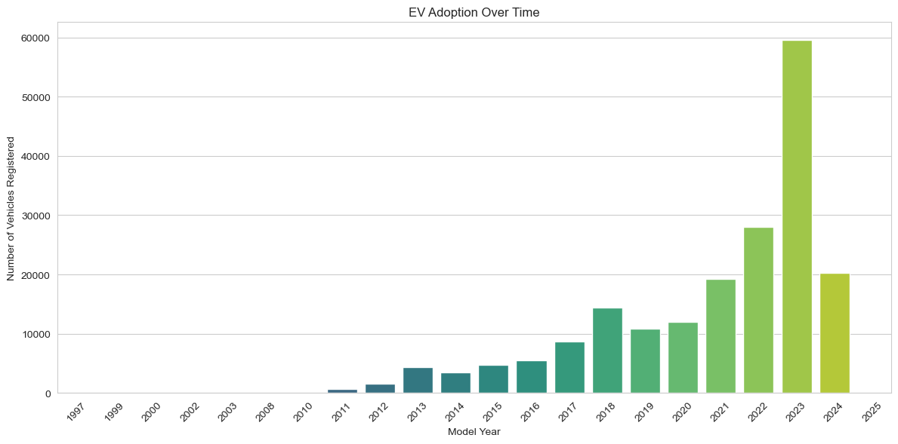
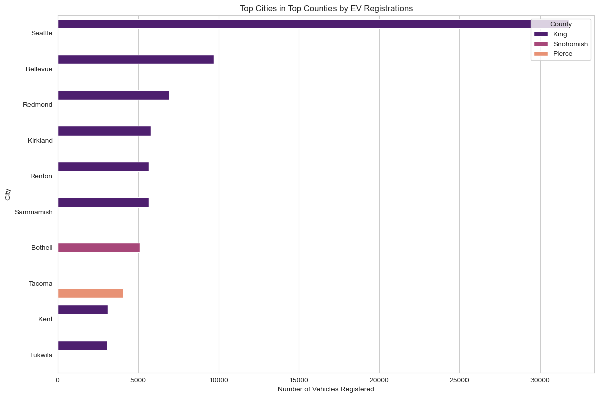
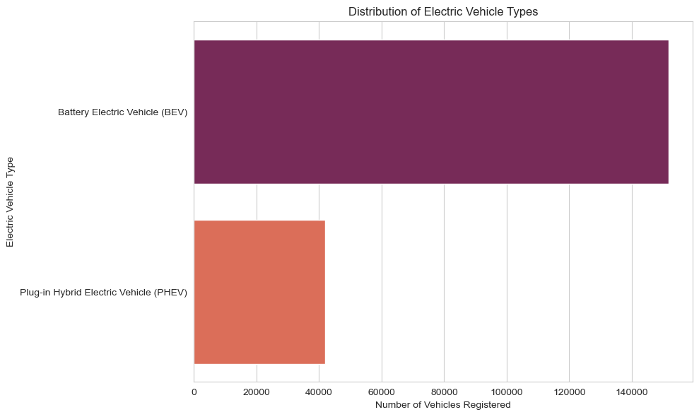
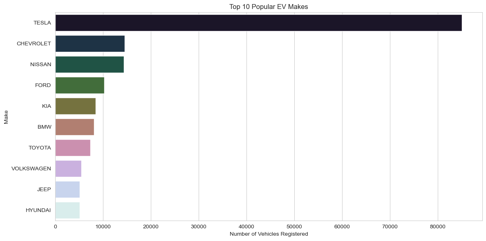
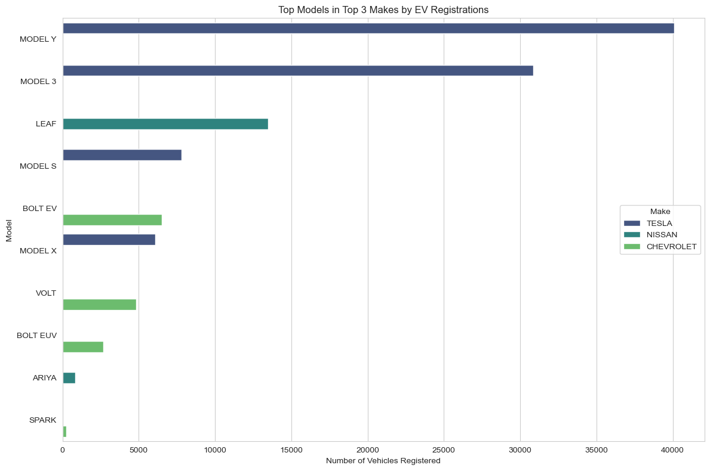
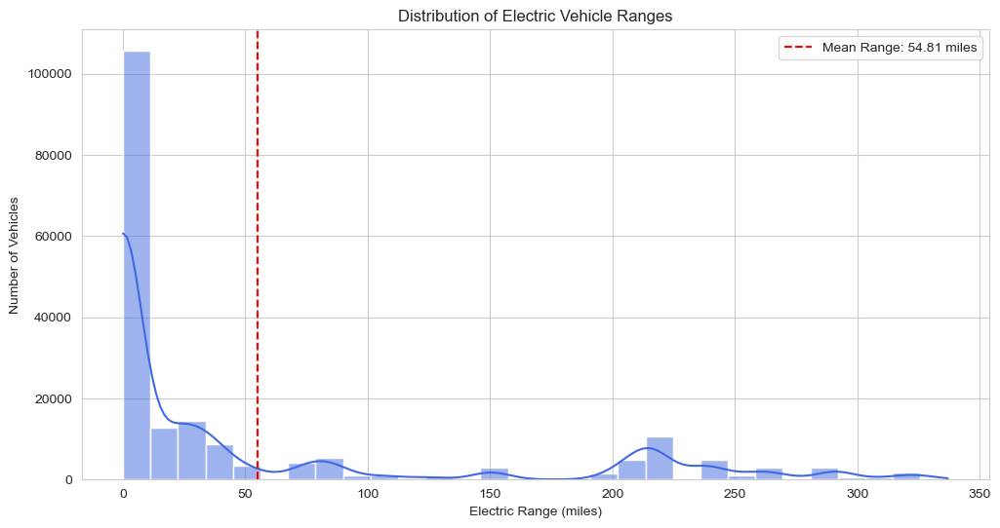
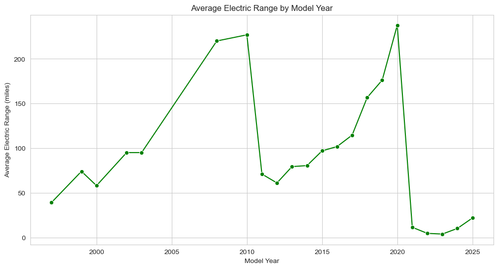
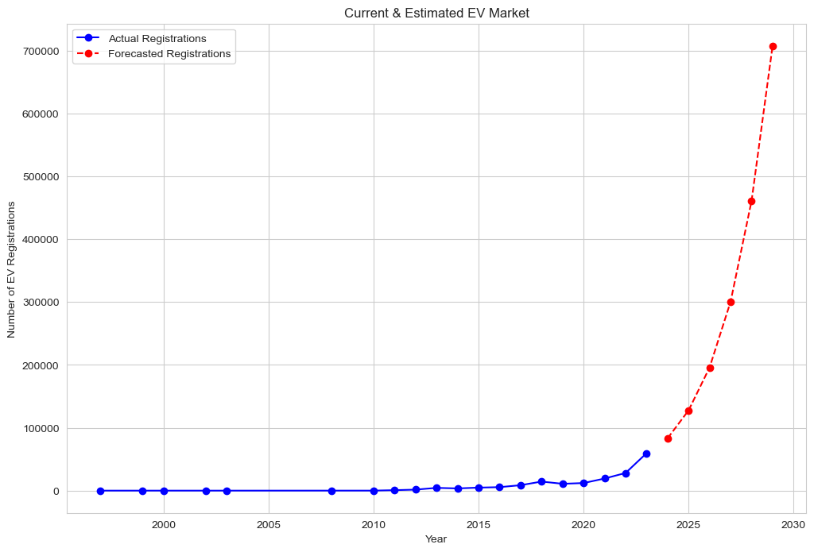

## EV-Data
Electric Vehicle Population Data

## Table of Contents

- [Project Overview](#project-overview)
- [Data Source](#data-source)
- [Data Dictonary](#data-dictonary)
- [Process](#process)
- [Data Analysis](#data-analysis)
- [Summary](#summary)

### Project Overview 
---

Market size analysis is essential in market research as it evaluates the potential sales volume within a specific market. It allows businesses to gauge the extent of demand, assess market saturation, and identify growth opportunities. This article will guide you on how to conduct a market size analysis for any product, specifically focusing on the Electric Vehicles market using Python.

### Data Source

Dataset used for analysis is Electric_Vehicle_Population_Data.xlsx, and extracted from https://data.gov/.

### Data Dictonary 
***VIN (1-10):*** Partial Vehicle Identification Number.  
***County:*** The county in which the vehicle is registered.  
***City:*** The city in which the vehicle is registered.  
***State:*** The state in which the vehicle is registered. It appears that this dataset may be focused on Washington (WA) state.  
***Postal Code:*** The postal code where the vehicle is registered.  
***Model Year:*** The year of the vehicle model.  
***Make:*** The manufacturer of the vehicle.  
***Model:*** The model of the vehicle.  
***Electric Vehicle Type:*** The type of electric vehicle, e.g., Battery Electric Vehicle (BEV).  
***Clean Alternative Fuel Vehicle (CAFV) Eligibility:*** Eligibility status for clean alternative fuel vehicle programs.  
***Electric Range:*** The maximum range of the vehicle on a single charge (in miles).  
***Base MSRP:*** The Manufacturer’s Suggested Retail Price.  
***Legislative District:*** The legislative district where the vehicle is registered.  
***DOL Vehicle ID:*** Department of Licensing Vehicle Identification.  
***Vehicle Location:*** Geographic coordinates of the vehicle location.  
***Electric Utility:*** The electric utility service provider for the vehicle’s location.  
***2020 Census Tract:*** The census tract for the vehicle’s location.  

### Process

Analyzing the market size for electric vehicles involves several key steps, including defining the market scope, gathering and preparing data, conducting analytical modeling, and presenting the findings through visualization and reporting. Here's a step-by-step process to follow for electric vehicles market size analysis:  
1. Determine whether the analysis will be global, regional, or concentrated on specific countries.
2. Collect information from industry associations, market research firms (such as BloombergNEF, IEA), and relevant government publications on the EV market.
3. Utilize historical data to identify trends in EV sales, production, and market dynamics. Analyze the market size and growth rates across different EV segments.
4. Based on the market size analysis, offer strategic recommendations for businesses aiming to enter or expand within the EV market.

#### Data Cleaning, Data Pre-processing, Data Transformation is done.
Refer [Code](template.py)

## Data Analysis

### EV Adoption Over Time by visualizing the number of EVs registered by model year

The bar chart shows a clear upward trend in EV adoption over time, with a significant increase starting around 2016. The number of registered vehicles grows steadily until 2017, after which it rises more rapidly. The year 2023 stands out with the highest bar on the graph, indicating a peak in EV adoption.

### Top Cities in top counties by EV Registration

The graph illustrates the distribution of electric vehicle registrations across cities in King, Snohomish, and Pierce counties. Seattle, in King County, leads with the highest registrations, significantly outpacing other cities. Bellevue and Redmond also show substantial numbers but fall short of Seattle’s figures. Cities in Snohomish County, like Kirkland and Sammamish, have moderate registrations, while Tacoma and Tukwila in Pierce County have the fewest. King County dominates the overall EV adoption, indicating a concentration of registrations in this area compared to the other counties.

### Distribution of Electric Vehicle Types

The graph indicates that Battery Electric Vehicles (BEVs) are more popular or preferred over Plug-in Hybrid Electric Vehicles (PHEVs) among the registered electric vehicles in the United States.

### Top 10 popular EV makes

The chart reveals that TESLA dominates with the highest number of registered vehicles, followed by NISSAN and CHEVROLET, though both have significantly fewer registrations. The manufacturers FORD, BMW, KIA, TOYOTA, VOLKSWAGEN, JEEP, and HYUNDAI trail in descending order of registrations.

### Top models in top 3 makes by EV Registrations

The graph highlights the distribution of electric vehicle registrations among the top three manufacturers: TESLA, NISSAN, and CHEVROLET. TESLA's MODEL Y leads with the most registrations, followed closely by MODEL 3. NISSAN's LEAF is the most registered non-TESLA vehicle, ranking third overall. TESLA's MODEL S and MODEL X also show significant numbers, while CHEVROLET's BOLT EV and VOLT have substantial registrations, followed by the BOLT EUV. The NISSAN ARIYA and CHEVROLET SPARK have the fewest registrations among the models listed.

### Distribution of Electric vehicle ranges

The graph displays the mean electric range of vehicles, revealing a high frequency of vehicles with a low range, peaking just before 50 miles. The distribution is right-skewed with a long tail towards higher ranges, though these are less frequent. The mean electric range is approximately 58.84 miles, which is relatively low compared to the maximum ranges depicted. Despite some vehicles achieving ranges up to 350 miles, the majority fall below the mean.

### Average Electric Range by model year

The graph illustrates the average electric range of vehicles from around 2000 to 2024, showing a general upward trend that reflects advancements in technology and battery efficiency. A notable peak occurs around 2020, where the average range reaches its highest point. However, following 2020, there's a significant drop, possibly due to incomplete data or the introduction of more lower-range models. The most recent year shows a slight recovery in the average range.

## Current and Estimated EV Market 

The graph indicates that actual EV registrations were low and stable until around 2010, after which there was a notable and consistent upward trend, reflecting a significant increase in EV adoption. The forecast suggests an even more dramatic rise in the near future, with registrations expected to increase sharply in the coming years.

### Summary
Market size analysis is essential in market research as it assesses the potential sales volume within a specific market. This analysis helps businesses gauge demand, evaluate market saturation, and uncover growth opportunities. Our analysis of the electric vehicle market indicates a promising future for the industry, highlighting a notable shift in consumer preferences and suggesting increased investment and business prospects in this sector.

### References
[Link](https://thecleverprogrammer.com/2023/07/22/data-analysis-projects-using-python/)

